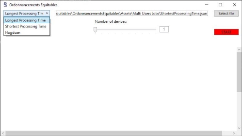
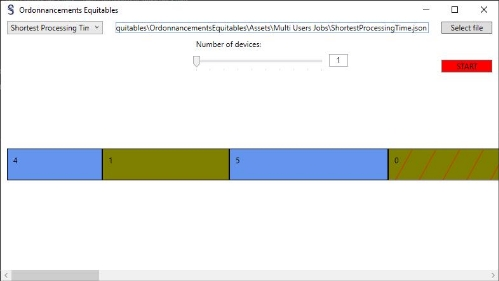

# ordonnancements-equitables

* **Encadrant** : Fanny Pascual (Fanny.Pascual@lip6.fr)
* **Titre** : Ordonnancements équitables
* **Étudiants** : Folco Bertini, Ali Touzi, Eyal Vayness

## Table des matières

1. Introduction
2. Jobs
   2.1 Job
   2.2 JobP
   2.3 JobCo
3. Modèles
   3.1 User
   3.2 Device
4. Structures de données
   4.1 MaxHeap
   4.2 Graph
    * 4.2.1 GraphLock
    * 4.2.2 GraphTimeD
5. Algorithmes
   5.1 Hogdson
   5.2 Glouton Par Profit
   5.3 Shortest Processing Time et Longest Processing Time
   5.4 Higher Lock degree et Higher Time Decrease
6. Parser
7. Interface Utilisateur
8. Annexes

## 1 Introduction

Les problèmes d’ordonnancement prennent comme données un ensemble de tâches, un ensemble de machines, et une fonction objectif, un but. Ils consistent à exécuter les tâches sur les machines de façon à optimiser la fonction objectif, sachant qu’une machine ne peut exécuter qu’une seule tâche à la fois. Par exemple, chaque tâche peut avoir une durée d’exécution et une deadline, un date limite, à laquelle elle doit être exécutée, et le but peut être d’exécuter les tâches de manière à minimiser le nombre de tâches en retard, ou la somme des retards des tâches. Dans le cadre de notre projet, nous n’avons pas de fonction objectif fixe.

Pour la conception de ce projet, nous avons coder des algorithmes d’ordonnancements existant et également conçu de nouveau. En présence de plusieurs utilisateurs qui chacun possèdent des tâches à ordonnancer sur des machines partagées.

Afin d’avoir une meilleur compréhension sur ce que fais les algorithmes, nous avons construit une interface graphique permettant de visualiser les ordonnancements obtenus.

## 2 Jobs

Les Job s représentent les tâches que nous voulons organiser de la meilleure façon par rapport aux critères de l’algorithme.

Nous pouvons les imaginer comme des briques qui sont manipulés par le programme. Ils sont donc (( passifs )) en considérant qu’ils n’agissent pas par eux

mêmes. Cependant ils restent au cœur même du projet.

Dans le domaine de ce projet nous identifions trois types de tâches: Job qui est le fondement de cette identité, JobP les tâches ayant un profit s’ils sont complétés à temps et JobCo qui correspondent aux tâches connectées.

### 2.1 Job

La classe Job est celle qui construit la base d’une tâche et lui donne les outils afin de pouvoir être manipulé par les algorithmes d’ordonnancement. Ceci stocke donc les éléments fondamentales que caractérisent un Job, c’est à dire son **Id**, le temps d’exécution nécessaire, **Time**, et sa date limite, **Deadline**.

De plus la classe contient toute une série d’outils qui favorisent l’accessibilité et la manipulation de la part des algorithmes. Par exemple on y trouve la comparaison entre Job s.

Avec les jobs on a déjà un objet utilisable et fonctionnel avec ce qui définit une tâche, par contre pour toute opération qui prend en compte des autres variables et hypothèse il est nécessaire les implémenter, ce qui est le cas pour les classes qui sont décrites ensuite.

### 2.2 JobP

La classe JobP hérite de la précédente et y ajoute le concept de profit: si la tâche se finie avant sa deadline alors elle rapportera un certain profit qui est spécifique à la tâche en question. Dans ce cas il sera probablement intéressant d’essayer, grâce aux algorithmes, d’organiser les jobs afin d’avoir au final un profit maximal. C’est une fonction objectif.

Ceci peut facilement être associé au cas d’un travailleur free-lance qui à des travaux à effectuer chaqu’un avec une récompense différente et une deadline pour le terminer

### 2.3 JobCo

La classe JobCo hérite de aussi de Job, donc elle en prends les éléments et s’équipe aussi du concept de dépendance. Il y a deux principale interprétations à ce principe de dépendance: cette tâche ne peux pas être exécutée tant que toutes les tâches dont elle dépend n’ont pas tous été exécuté, ou bien pour chaque tâche

(( père )) complétée en amont, son temps d’exécution est réduit de un (mais ne peut pas atteindre 0).

Afin d’intégrer ces fonctionnalités d’une façon optimale et qu’elle soit adaptable aux deux interprétations, la classe contient la liste des ID des tâches dont elle dépend, le temps d’exécution effectif et garde en mémoire son état bloqué ou prêt.

Si nous voulons concrétiser ce genre de tâche on peut prendre inspiration d’une chaîne de montage, où certains étapes de production doivent être effectués en un certain ordre et enchaîner deux ou plus tâches consécutives peut éviter des déplacements ou positionnements qui feraient perdre du temps.

## 3 Modèles

Afin de reproduire l’ordonnancement de tâches nous avons besoin d’une implémentation d’utilisateurs, qui détiennent les tâches, et de machines pour les exécuter.

### 3.1 User

La classe User représente un utilisateur. Un utilisateur possède un tableau de Job s ou d’une classe qui en hérite. La méthode publique Contains permet de savoir si la tâche envoyer en paramètre appartient ou non à l’utilisateur en question. Dans le

cadre de ce projet, il n’y a pas de priorité entre les utilisateurs. C’est pour cela qu’un cas avec plusieurs Users peut toujours se ramener à un cas similaire avec un seul uitlisateur.

### 3.2 Device

La classe Device représente une machine sur laquelle on peut exécuter des tâches. Un Device possède aussi une liste de Job s. Ce sont les tâches exécuter par la machine en question et trier dans l’ordre d’exécution. La propriété TimeReady permet de savoir le temps d’exécution de toutes les tâches d’un Device. C’est grâce à cela que l’on détermine qu’elle machine est prête en premiere à pouvoir exécuter la prochaine tâche.

## 4 Structures de données

### 4.1 MaxHeap

MaxHeap est une structure basé sur le concept de tas decroissant. Ceci a été intégré dans le projet afin d’optimiser l’algorithme Hogdston car l’insertion et l’extraction du maximum sont en O(log(n)). L’alternative (( naïve )) pour trouver le maximum aurait été de parcourir tous les éléments en stockant l’indice du maximum, ce qui impliquerait une complexité en (n).

La structure inclut les fonctions Insert() et RemoveMax(), permettant de construire le tas par insertion et d’en récupérer le maximum jusqu’à qu’il soit vide. Cela est plus que suffisant afin de répondre aux nécessités du algorithme qui s’attend juste à récupérer à chaque fois le job avec le plus long temps d’exécution. Alternativement il aurait aussi été possible de trier l’ensemble des jobs mais on ne pourrait pas descendre de complexité en dessous de O(nlog(n)).

### 4.2 Graph

Un Graph représente un graphe orienté. Il contient un tableau de tous les JobCo construisant ce graphe, une liste de tâches qui n’ont pas encore été executé et une liste d’adjacence pour modéliser le graphe en question. Lorsqu’une tâche du graphe est exécutée, elle est retirée du graphe. On réalise cela grâce à la fonction ExecuteJob(JobCo jobCo).

La fonction principal de cette classe est GetHigherOutDegreeOnTime(int time), elle permet de récupérer le JobCo de plus haut degré sortant, non bloqué, avec le plus petit temps d’exécution et à l’heure par rapport au paramètre **time**. Grâce à cette fonction, il est possible de coder les algorithmes qui utilisent un Graph.

#### 4.2.1 GraphLock

GraphLock est un classe qui hérite de Graph. La particularité de ce graphe est que est que les jobs qui dépendent d’autres tâches sont bloqués tant que ces derniers ne sont pas exécutés. Ainsi la fonction ActualiseConnectedJobs(JobCo JobCoCo) permet de débloquer les jobs lorsque les tâches dont ils dépendent ont été exécutées.

#### 4.2.2 GraphTimeD

GraphTimeD hérite également de Graph. Ici, lorsqu’un job J dépend d’autres jobs que nous appellerons Di, le temps d’exécutions de J sera décrémenté de 1 pour chaque tâche Di exécutée avant J . Le temps d’exécutions sera mis à jour à l’aide de

la fonction ActualiseConnectedJobs(JobCo JobCoCo).

### 5 Algorithmes

### 5.1 Hogdson

Cet algorithme est codé dans Hogdson.cs dans la fonction Execute(Job[] jobs). **Principe** L’idée, pour une machine et un utilisateur, est de trier tous les Job s à

effectuer de manière à en avoir le plus possible à l’heure, c’est-à-dire que leur temps

d’exécution plus le temps actuel soit inférieur à leur **deadline**.

Pour se faire on ajoute chaque job dans la liste des Job s à l’heure, puis si un Job n’est pas à l’heure, on récupère dans cette même liste celui dont la durée d’exécution est la plus longue. Si on a plusieurs utilisateurs, on réunis tout leur jobs à trier puis on les exécute de la même manière.

**Analyse** La complexité de cet algorithme en nombre d’opérations d’ajout pour un ou plusieurs utilisateurs est en O(n2) puisque dans le cas de plusieurs utilisateurs on

se ramène au cas d’un seul utilisateur.

Cette algorithme perd donc en efficacité lorsque le nombre de Job à exécuter augmente mais est utile si on ne soucie pas du rôle des Job s, puisqu’on se concentre sur uniquement sur le fait d’en exécuter un maximum.

### 5.2 Glouton Par Profit

Cet algorithme est codé dans GloutonParProfit.cs dans la fonction Execute(JobP[] jobs).

**Principe** L’algorithme d’ordonnancement glouton par profit trie des JobP, c’est-à-dire des tâches avec un profit, dans un ordre où le profit total est maximisé en prenant en compte les deadline de chacun. Ceci est le principe pour une machine et un utilisateur.

Si on a plusieurs utilisateurs, comme pour Hogdson, on réunis les jobP dans une liste et on se ramène au cas précédent.

**Analyse** Cet algorithme, relativement au nombre d’opération d’ajout, a une complexité en O(n2), que ce soit pour un ou plusieurs utilisateurs sur une machine.

Glouton Par Profit est utile lorsque le rôle des tâches effectuer est pris en compte, à l’inverse de Hogdson qui favorise la quantitée.

### 5.3 Shortest Processing Time et Longest Processing Time

Ces algorithmes sont codés dans ShortestProcessingTime.cs et LongestProcessingTime.cs chacun dans sa fonction Execute(Job[] jobs, int nbDevices).

**Principe** Leur fonctionnement est similaire: sur une machine pour un utilisateurs, pour Longest processing time, on trie par ordre décroissant le temps d’exécution des jobs et pour Shortest processing time par ordre croissant.

Si on a plusieurs utilisateurs pour une machine, on réunis les jobs et on se ramène au cas d’une machine et d’un utilisateur.

Si on a plusieurs machine et un utilisateur, une fois les jobs triés comme pour une machine, on les distribue à la première machine prête.

Finalement, pour plusieurs utilisateurs et plusieurs machine, on réunis à nouveau toute les tâches à effectuer par les utilisateurs et on se ramène au cas précédent.

**Analyse** Les complexités en nombre d’opération d’ajout de Shortest et Longest Processing Time sont en O(n2).

### 5.4 Higher Lock degree et Higher Time Decrease

**Principe** Les deux algorithmes sont identiques, seulement un modifie le temps d’exécution des tâches dans Higher Time Decrease tandis qu’on débloque des jobs bloqués, autrement dit en attente de l’exécution d’une ou plusieurs autres tâches, dans Higher Lock Degree.

L’idée est, pour une machine et un utilisateurs, de créer un graphe orienté avec les JobCo. Une fois ce dernier créé, on récupère un jobCo avec le degré entrant le plus grand, autrement dit un job qui dépend le plus d’autres tâches, puis on exécute ce job ou les tâches dont il dépend et ainsi de suite. On réitère ce procédé jusqu’à avoir exécuté toute les tâches exécutables.

Pour plusieurs utilisateurs et une machine, on réunis toutes les tâches et on les exécute de la même manière que précédemment.

Si on a plusieurs machine pour un utilisateurs, on crée le graphe, on recherche les tâches à effectuer selon les dépendances, puis on les distribue au fur et à mesure à la première machine prête.

Pour plusieurs machines et plusieurs utilisateurs, on réunis les jobs des utilisateurs pour en créer un graphes, et on se ramène à la situation précédente.

**Analyse** Chacune de ces fonctions à une complexité en nombre d’ajout en O(n2).

On sait qu’une tâche exécutée par un ordinateur nécessite souvent certains pré-requis, autrement dit des sous-tâches à effectuer pour réaliser la tâche finale. Celle ci sera alors bloquée ou exécutée plus vite selon la situation. Higher Lock degree et Higher Time Decrease sont donc utile pour nous rapprocher de ces cas de figures.

## 6 Parser

Nous voulions laisser la possibilité à tout le monde de personnaliser les tâches qui seront ordonnancées par les différents algorithmes. Nous avons donc opter pour des fichiers au format JSON afin de faire l’interface entre les utilisateurs et les algorithmes. Dans le format suivant:


```json
{
    "job_type": "Job/JobP/JobCo",
    "job_list":
    [
        {
            "time": 3,
            "deadline": 9,
            <"profit": 5, >
            <"depend": [2,3], >
        }, ...
    ]
    
    <OU BIEN>
    
    {
        "time": 4,
        "deadline": 12,
        <"profit": 2,>
        <"depend": [],>
    }, ...
}
```

Le champ job\_type permet au parser de renvoyer une liste correctement typée des tâches qui sont décrites dans le champ job\_list. Les Job s sont décrits un à un comme ci-dessus. Pour décrire un cas avec plusieurs Users, on dispose les Job s dans des tableaux JSON afin que le parser puisse attribuer à chaque Job son User.

## 7 Interface Utilisateur

Un retour visuel d’un algorithme d’ordonnancement permet de bien voir son fonctionnement. Alors deux choix s’offrait à nous: un projet en console qui sort un fichier image, ou bien une application de bureau avec un retour visuel direct. Pour simplifier l’utilisation, nous avons opté pour l’application desktop sur Windows que l’on voit dans la figure 1. Cette option ne simplifie pas la conception du projet.


Fig. 1 – Interface Utilisateur

Afin de choisir l’algorithme à utiliser, l’utilisateur dispose d’un menu défilant. Lors du lancement de l’application, sans qu’aucun fichier sois sélectionner au préalable, tout les algorithmes sont disponibles. Comme on peut le voir dans la figure 2.

Lorsque qu’un fichier, au format explicité la section précédente, est choisi; les algorithmes qui sont proposés sont filtrés pour ne laissé que ceux qui ne fonctionne avec le type de Job explicité dans le fichier choisi. C’est ensuite à l’utilisateur de choisir l’algorithme à utiliser pour ordonnancer la liste de tâche qui a été parsé. Cela est notamment visible dans la figure 3.


Fig. 2 – Interface Utilisateur - Menu défilant



Fig. 3 – Interface Utilisateur - Choix de l’algorithme

Dès lors qu’un algorithme a été sélectionné, on peut lancer son exécution. Une fois le bouton **START** rouge cliqué et l’exécution terminé, le résultat apparaît au milieu de la fenêtre. Une ligne de tâches correspond à l’exécution sur une machine. Lorsqu’un Job est en retard, cela est visible par les hachures rouge qui le compose.

Par défaut, l’exécution se fait sur une unique machine, comme on le remarque dans la figure 4. La figure 5 représente l’exécution des mêmes tâches et par le même algorithme, mais cette fois sur 6 machines distinctes que l’on distingue par 6 lignes d’exécution différentes. On y voit aussi très bien le principe de l’algorithme de Shortest Processing Time.



Fig. 4 – Interface Utilisateur - Retour Visuel Après Exécution


Fig. 5 – Interface Utilisateur - Exécution Sur Plusieurs Machines

L’exécution de l’algorithme Higher Time Decrease est très particulière car elle permet de réduire le temps requis aux tâches pour finir leur exécution. Nous avons donc choisi un affichage comme celui de la figure 6. Chaque ligne d’exécution est divisée en deux. Celle du haut représente le temps rée de réalisation des tâches, donc avec la réduction. En revanche celle du bas est la timeline d’exécution sans réduction du temps de complétion. Cet affichage permet de voir le temps gagné en comparant les deux timeline d’exécution (avec et sans réduction) pour chaque machine.


Fig. 6 – Interface Utilisateur - Exécution De Higher Time Decrease

Il est par ailleurs possible d’exécuter un algorithme sans avoir sélectionné de fichier au préalable. Cela va alors faire une exécution par défaut avec une liste de tâches déjà faite. En revanche, les exécutions par défaut ne se font qu’avec un seul utilisateur.

### 8 Annexes

Il est possible de voir tous le code de notre projet au lien Github ci-contre: [www.github.com/VetFalco/ordonnancements-equitables](www.github.com/VetFalco/ordonnancements-equitables)
